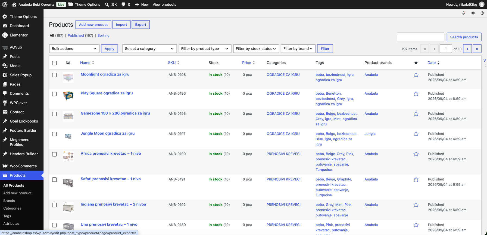

# NMark Designs

Incremental rebuild of [nmarkdesigns.com](https://nmarkdesigns.com/) with Next.js App Router, React, strict TypeScript, and Tailwind CSS.

The reference-based homepage, a standalone Services page, Portfolio index, eight project case-study pages, About, Contact, Pricing, and a Blog with five articles are available in Serbian and English — 58 public localized pages in total. Contact form validation is implemented, but delivery is unavailable until a mail provider is integrated.



## Development

Use Node.js 24 LTS (see `.nvmrc`; `package.json` requires >= 22) and npm.

```sh
npm ci
npm run dev
```

Open http://localhost:3000/sr/ or http://localhost:3000/en/. The root redirects to Serbian. If that port is occupied, pass another port with `npm run dev -- --port 3001`.

Copy `.env.example` for deployment-related variables; local development works without any of them.

## Verification

```sh
npm run lint
npm run typecheck
npm run build
npm run test:e2e
```

Browser tests use Google Chrome and start the production build on port 3100 (`playwright.performance-qa.config.ts` uses port 3102). Install Chrome locally, or run `npx playwright install chrome` in a CI environment. Build before running browser tests. Screenshots and failure traces go to the ignored `test-results/` directory.

DM Sans is self-hosted by `next/font/google`; the first build requires access to Google's font service. Latin and Latin Extended subsets support Serbian Latin text.

ESLint 9 is currently pinned to stay within the React lint plugin's supported peer range. npm marks this major as deprecated; update the lint toolchain when that plugin supports ESLint 10. This is development tooling only.

## Structure

- `app/[locale]/`: localized root layout and statically generated homepage, Services, Portfolio, Blog, project detail, article, About, Contact and Pricing routes.
- `app/globals.css`: unchanged Phase 1 typography and design tokens.
- `components/layout/`: shared header, logo, navigation, and footer.
- `components/home/`: Hero, FeaturedProjects, Services, CTA, and FAQ.
- `components/services/`: standalone Services page content.
- `components/portfolio/`: reusable project presentation.
- `components/blog/`: blog index, article pages, cards, and share controls.
- `components/about/`: shared About introduction, founder profile, and mission content.
- `components/contact/`: shared Contact content and progressively enhanced form.
- `components/pricing/`: shared packages and published commercial terms.
- `components/seo/`, `lib/schema.ts`: safely serialized, verified JSON-LD.
- `lib/contact*.ts`: typed form state, explicit validation, and the currently unavailable server-only delivery adapter.
- `components/ui/`: typed Button and Container primitives.
- `content/site.ts`: shared verified business information.
- `content/i18n/`: typed Serbian and English dictionaries, loaded on the server.
- `content/projects.ts`: verified project identities and local screenshots; unknown fields stay optional.
- `content/blog.ts`, `content/blog-editorial.ts`, `content/blog-pricing-guide.ts`: typed localized blog data and article bodies.
- `lib/i18n.ts`, `lib/routes.ts`: locale types and equivalent route mappings.
- `lib/metadata.ts`: localized titles, descriptions, canonicals, and language alternates.
- `lib/public-pages.ts`: published URL inventory shared by metadata, sitemap and route validation.
- `lib/legacy-redirects.ts`: exact approved WordPress mappings.
- `lib/seo-config.ts`, `lib/crawl.ts`, `app/robots.ts`, `app/sitemap.ts`: indexing policy and crawl configuration.
- `proxy.ts`: security headers (CSP, HSTS, framing/sniffing/referrer/permissions), exact permanent redirects, trailing-slash normalization, strict route validation and host-aware noindex response headers.
- `public/logo/`, `public/images/`, `public/projects/`: intentionally migrated local assets.
- `tests/`: browser behavior, layout, accessibility, and performance checks.
- `docs/`: reference material, design decisions, and migration reports.

Pages and layouts render on the server. The small client boundaries are `MobileNavigation`, `LanguageSwitcher`, `FAQAccordion`, and `ContactForm`. The menu retains its native disclosure fallback. Language links work without JavaScript, and all FAQ answers remain visible without JavaScript. With JavaScript, the FAQ exposes button controls and expanded state, with the first answer initially open. Contact uses a native Server Action and localized validation, also usable without JavaScript.

## Adding Localized Content

Add shared fields to `content/i18n/types.ts` and provide both dictionaries. Resolve content with `getDictionary(locale)` in Server Components. Business information belongs in `content/site.ts`; project-specific content belongs in `content/projects.ts`; blog articles belong in `content/blog.ts` with bodies in the editorial modules. Do not duplicate localized JSX.

`lib/routes.ts` maps semantic route keys to translated slugs and implementation flags. Once a core page is implemented in **both** languages, set its `implemented` flag to `true` and use `localizedPath` for metadata. The language switcher maps equivalent paths, including portfolio and blog detail slugs. It does not store locale in React state, cookies, or localStorage. Unknown routes have no switch target.

## Migration State

There are 58 public localized pages, derived from `lib/public-pages.ts`: `/sr/`, `/en/`, the localized Services (`/sr/usluge/`, `/en/services/`), About, Contact, and Pricing pages, both Portfolio and Blog indexes, both locale versions of eight project case studies, and five localized blog articles. `/` permanently redirects to `/sr/` (308). Exact legacy paths redirect directly to their Serbian equivalents, including slashless requests. Valid localized pages normalize to trailing slashes. Unknown locales, slugs, case variants and extra segments return 404. No browser-language detection is used.

All primary navigation and CTAs use localized internal URLs. Header, mobile navigation and Footer resolve Services through the shared route helper to the standalone page; the homepage keeps its `id="services"` section with a link to the full page. Showcase links open local project details; verified client sites remain external same-tab links. Services, About, Contact and Pricing share `app/[locale]/[page]/page.tsx`, restricted by `corePageRoutes`.

Contact delivery is deliberately unavailable. `lib/contact-delivery.ts` sends and stores nothing; `available: false` exposes an upfront notice. The Server Action validates input and reports unavailable rather than claiming success. Integrating delivery requires an approved provider/SMTP service, server-only credentials, verified sender and recipient, spam/rate controls, and delivery tests. Do not enable the flag or return `accepted` without a real provider acknowledgement. See [the Phase 5B report](docs/phase-5b-report.md).

Project content lives in `content/projects.ts`. A populated `caseStudy` plus a featured image enables a static detail route; absent narrative/gallery fields render no placeholder sections. Client names, website URLs, tools, and editorial decisions are recorded in [project content sources](docs/reference/project-content-sources.md). No challenge or results narrative has been invented to fill the template.

## SEO & Security Configuration

`content/site.ts` owns the canonical production origin. Every localized page self-canonicalizes; `sr`, `en` and Serbian `x-default` refer only to real equivalents. `/sitemap.xml` lists the 58 canonical pages, without fabricated modification dates or ranking hints. Organization/WebSite, About Person and case-study BreadcrumbList data use verified content only.

Canonical production pages emit `index, follow` metadata. Indexing is gated at request time by host: no build-time launch flag is required.

The proxy allows indexing only on the exact configured production host. Other hosts receive `X-Robots-Tag: noindex, nofollow`. Dynamic `/robots.txt` disallows everything on those hosts; the production host allows public crawling and advertises the sitemap. Static HTML may contain index/follow on an alias, but the more restrictive response header applies. Keep hosting-level deployment protection enabled for private previews; robots rules are not access control.

Every proxied response also carries hardened security headers: a restrictive Content-Security-Policy, HSTS (2 years, includeSubDomains, preload), `X-Frame-Options: DENY`, `X-Content-Type-Options: nosniff`, `Referrer-Policy: strict-origin-when-cross-origin`, and a Permissions-Policy that disables unneeded browser features.

Configure HTTPS and redirect `www`/HTTP aliases at the hosting layer. Do not reuse a production artifact on an unprotected preview host that bypasses the Next.js proxy. See `.env.example` and [Phase 6 report](docs/phase-6-report.md) for migration decisions, remaining content decisions and validation.

See [the implementation plan](docs/implementation-plan.md), [migration notes](docs/migration-notes.md), [frontend guidelines](docs/frontend-agent.md), and the phase reports in `docs/` for per-phase decisions.
